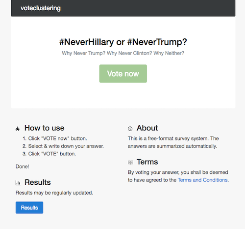

# 2016 US presidential election dataset
This is an opinion graph dataset of a poll on the 2016 US presidential election. 
The question we asked is "#NeverHillary or #NeverTrump." 
The opinion graph represents the responses to this question. 
For mroe details of the dataset, please refer to Ref. [1].

## graphml

+ Vertex attributes
  - id
  - opinion text
  - inferred group label
+ Edge attribute
  - Edge label ("+1", "-1", "0")

This is a dataset after the edges are "neutralized" randomly. 
"0" edges represent neutral edges, which were "-1" edges originally.

## Data collection details
The data were collected by an online survey system (voteclustering_ver0.2). 
A significant fraction of data were collected from the people who visited University of Nevada, Las Vegas on Oct. 18th and 19th, 2016, which are the day before and the day of the final presidential debate. 
The dataset contains no personal information of the respondents. 
12 opinions are the seed opinions that were initially set before the poll. 

No financial or political support is involved.

## Survey system
Here is how the top page of voteclustering_ver0.2 looked like.

## Citation
Please cite the following article when you use this dataset and contents herein. 

[1] Tatsuro Kawamoto and Takaaki Aoki, "Democratic summary of public opinions in free-response surveys," to appear (2019).
