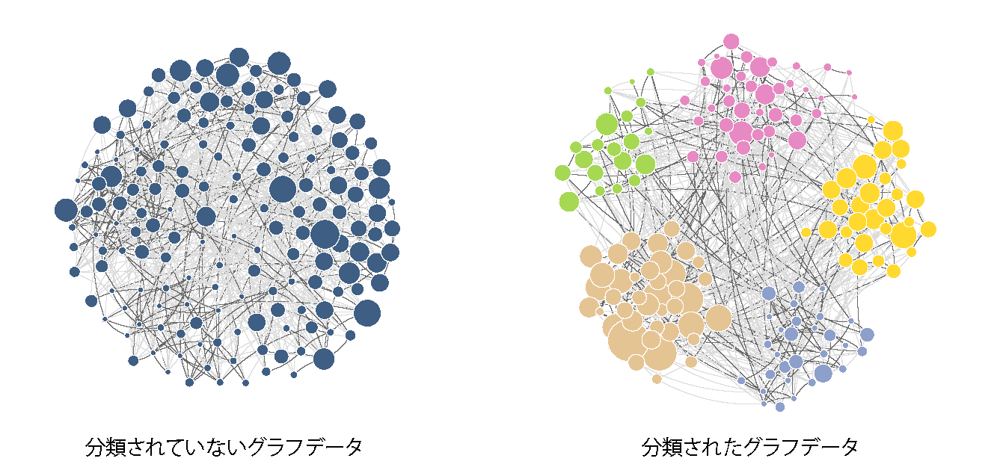

# 論文のまとめと詳細
> [Tatsuro Kawamoto and Takaaki Aoki,  
> "Democratic classification of free-format survey responses using a network-based framework,"  
> Nature Machine Intelligence, 1, 322–327 (2019).](https://www.nature.com/articles/s42256-019-0071-y)

この論文はアイディア論文で、ベースは非常にシンプルです。
ここに論文のポイントのまとめと、その他細かいことを書いていきます。

**目次**

0. 背景
1. 概要
2. 実例
2. この方法の特徴
3. グラフ分割アルゴリズムについて
4. 技術的・理論的な後ろ盾
5. 先行研究
6. 考えられる質問とその答え
7. 改善点
8. 名前の由来
9. 実証実験

## 0. 背景
ネット上には、膨大な意見や感情が日々溢れています。しかしいくら何十万人もの人が持論を主張して共感を呼びかけても、それらは通常、一瞬誰かの目に止まるだけです。
このような「垂れ流して終わり」の形式ではなく、何かしら体系だった情報を構築する形式を実現したいと思いました。

意見や感情の集約は非常に自由度が高く、難しい問題です。
このような問題は、人文・社会科学の分野で研究されていますが、ここには「大量の意見をどう処理するか」という技術的な問題も存在しています。

> 人力による意見集約は、膨大な労力がかかるうえに、集計者の主観による恣意性も入る（写真提供：香川大学 時岡晴美氏）

## 1. 概要
一言で言うと、「大規模な自由記述式アンケートを、グラフ（ネットワーク）データとして収集すると、効率よくフェアな集計ができるよ」という話です。

### 自由記述式アンケート
この論文では、以下のようなアンケートの仕組みを提案しています。
与えられた質問に対し、回答者に次の２つを答えてもらいます。

1. ランダムに数個抽出された他人の回答を読み、賛成するかどうかを回答する（選択式回答）
2. 抽出された回答のなかに完全に自身の回答と一致するものがなければ、自分の回答を書き込む（自由記述式回答）

上の手順は逆でも構いません。実際、論文では（説明のしやすさの都合上）自由記述回答を最初にし、その後他人の回答と比較するという手順を提案しています。

こうして集まったデータは、上図のようなグラフ（ネットワーク）を構成します。グラフの一つ一つの頂点が回答者の意見文章を表し、枝が意見間の関係性を表します。
このデータにグラフ分割アルゴリズム（機械学習の一種）を施すことによって、自由記述を含む回答群を、意味として似たものにグループ分けすることができます（下図）。

アンケート実施者の前処理・後処理は、以下の２つです。

- [前処理] 質問文章と、各質問についての幾つかの回答候補をセットする（どんなアンケートにも必要）

- [後処理] グループ分けした後の意見集合を見て、グループの意味を解釈する（ここに不満を感じる人は、下の**考えられる質問とその答え**を参照してください）

基本的には、これだけの非常にシンプルな話です。

## 2. 実例
論文では、２つの実証例を載せています。
そのうちの一つが、2016年アメリカ大統領選挙です。

"**#NeverHillary or #NeverTrump?**"というタイトルで、ウェブ上および、大統領ディベートの会場（ネバダ大学 ラスベガス校）での街頭アンケートによってデータを収集しました。

> 2016年アメリカ大統領選のPresidential Debateの際、ネバダ大学ラスベガス校に設置されたCNNの特設スタジオ

得られたデータから、以下のような３つの意見グループが抽出されました。

ヒラリー支持者とトランプ支持者のグループが出現することは、自明でしょう。しかし、回答文章自体には、誰を支持しているのか明記されていないものも多くあります。
この曖昧性は、ヒラリー支持でもトランプ支持でもないグループにおいては、一層非自明です。

このデータは、[Githubのリポジトリ](https://github.com/tatsuro-kawamoto/opinion_graphs/tree/master/2016USpresident)から取得することができます。

## 3. この方法の特徴
大事なポイントを最小限にまとめると次の３つです。

- 自然言語処理をしない
- 自由記述式アンケートに対して"民主的な"集計ができる
- 各回答者が集計作業を分散処理しているため、大規模アンケートに対応できる

### 自然言語処理しないで意見分類
ここでの目的は、人々の回答した文章を分類することです。しかし、自然言語（回答文章）は回答者同士が互いに参照し合うためだけに使い、アルゴリズムは言語データを一切使うことなく文章の分類を行います（もちろん自然言語処理を混ぜてもよいのですが、それについての詳細は**考えられる質問とその答え**を参照してください）。
人間が得意なことは人間がやり、機械が得意なことは機械がやるということです。

意見の類似性など、尺度が曖昧な部分はすべて人間側で処理するので、グラフデータ処理の時点では言語に由来する曖昧性がありません。
これによって、ちゃんと統計解析ができるようになります（この後の**統計的有意性**も参照）。

### "民主的"なアンケート集計
ここでの回答結果の分類は、回答者自身の選択のコンセンサスによって決まっています。
これは、集計者が独断的な判断と基準による全手動の分類とも、単語の類似性等から決める全自動の分類とも異なる、"民主的"な分類になっています。

### スケーラブルなアンケート集計
選択式回答と自由記述式回答を組み合わせてグラフデータにすると、各回答者が集計作業を分散処理していることになります。それらをグラフ分割アルゴリズムでまとめ上げることにより、数万人の自由記述アンケートでも効率良く集計することができます。

通常の選択式アンケートでも、因子分析（factor analysis）をすることを考えると、ここでの解析と似たようなことをしていると言えます（論文のDISCUSSIONの節でも言及）。
しかし、ここでのポイントは、あらかじめ選択肢を限定することのない自由記述形式であっても扱える点にあります。

### 常に使える
自由記述式アンケートと言っても、インターフェイスとして、見た目には古典的なアンケートとほとんど変わらず、自由記述回答がまったく投稿されない場合は、完全に従来の選択式アンケートに帰着します。
従って、調査設定として使えない場合というケースはありません。

原理的には自由記述という無限の自由度を持ちながらも、バランスのとれた自由度になるように調整されるという意味で、"ノンパラメトリック"なアンケートという言い方をしています。

### 多様な意見を誘発する
他人の意見に影響されるこのアンケート方法は、フェアではないという意見はよく出ます。
それはその通りだと思います。しかし、例えば何の参考情報もなく、いきなり「最近の我が国の問題についてどう思いますか？」と聞かれた場合、まともに答えられる人が何割いるでしょうか。そこで持論を述べられる人も、必ず何かしらバイアスのかかった情報源からの情報を得たうえで、自らの意見を回答しているはずです。であれば、特定の仮説検証をしたい心理学実験等の例を除き、積極的に多様な意見を誘発する形式のほうが、記述式回答を求めたいアンケートとしてはメリットが大きいはずです。その意味で、統計処理をする必要がないくらいの小規模アンケートであっても、紙ベースで（無参照で）集めてきたアンケートよりも、質の高い回答が期待できます。

### ミクロな解析にも役立つ
回答者が誤解をしている場合など、専門家からすると矛盾した回答を入力することがあります。
例えば、2016年のアメリカ大統領選挙の例（論文のRESULTの節を参照）でいうと、トランプ支持の回答と「保険は大事」という回答の両方に賛成している人がいたとします。
専門家からすると、「保険は大事」というのであれば、Obama careを支持するべき人なはずなので、むしろ民主党のヒラリー支持であるはずです。
しかし、おそらくこの人はトランプ氏に１票を投じたでしょう。
このように、個々の回答について、より詳細に掘りすすめることができるのも、このアンケートの特徴です。

### 統計的有意性
意見データをグラフデータとして収集することによって、自由記述を含んだアンケート調査でも、ちゃんと統計学ができるようになっています。
人によって基準が異なったり、誤解があったりというエラーがあることを全面的に受け入れ、そのもとで解釈可能な情報抽出ができるかを問うことができます。

もちろん、統計的に有意かどうか（ちゃんと仮説を置いたもとで評価するか）は気にせずに、ありとあらゆるチューニングを施して、"なんとなく良さそう"な処理をすることもできると思います。
しかし、そのような処理のもと得られる集計結果は、数理的な後ろ盾を失うだけでなく、その正当性は、結局最終的には集計者の判断（主観）に全面的に委ねられるものになり、アンケート調査としての"民主性"は失われます[^1]。

[^1]: このような、なんらかの前処理のもとでの独断的な評価を"してはいけない"理由はないと思いますし、可能であれば両方やって比べるべきかと思います。

### 答えやすさと分解能のトレードオフ
ある２つ意見について、２つは同じと答える人もいれば違うと答える人もいるでしょう。はっきりとした意見間の隔たりがないアンケートでは、いくつにグループ分けをし、どのような意見を同じグループとしてまとめるかは非自明です。
ここで、例えば２人の回答者が別々の評価をした場合、どう分類して良いかはデータから判断できません。しかし、100人のうち80人が同じ判断をしたのであれば、より確からしい分類が可能です。

つまり、一人一人に評価してもらう負担を増やせば、微妙な意見の相違もグラフ分割によって抽出することができます。逆に回答者の負担を軽くしても、比較的簡単な分類になるアンケートならばちゃんと分類できる、というトレードオフになっています。

（少し専門的な説明） 
ここで出来上がるグラフは、スパースグラフになります。
回答者が答えるたびに頂点が増えていきますが、回答者が張る枝の数は定数のため、グラフの平均次数はデータサイズによらず定数だからです。
もし平均次数がグラフのサイズとともに増加していけば、（モデルの仮定が正しいという仮定のもとで）漸近一致性（strong recovery）がありますが、今の場合そのような一致性はありません。
一般に、グラフがスパースかつモジュール構造が弱いほど、一様ランダムグラフと統計的に見分けがつかないグラフインスタンスになり、この限界は検出限界（detectability limit）として知られています。

## 4. グラフ分割アルゴリズムについて
### 名称について
グラフ分割というのは昔からある機械学習技術ですが、現在進行形で発展している技術でもあります。
厳密に言えば、"グラフクラスタリング"と呼ぶのが正確な言い方で、グラフ分割といった場合には、「分割数があらかじめ指定されている問題」を指します。
また、グラフクラスタリングは、一般のグループ構造の検出を意味しますが、そのなかで特に、密につながったグループ構造（assortative structure）を抽出する問題は「コミュニティ検出」と呼ばれています。
（論文中ではグラフクラスタリングと言っていますが、文字面のわかりやすさのため、個人的にはグラフ分割と呼ぶことが多いです。）

### 論文で使用しているアルゴリズム
論文中ではbelief propagationを用いたEMアルゴリズム（Decelle et al. (2011)をベースにしたもの）を、枝にラベルがついたモデルに拡張して使用しています。
これを採用した理由は、以下の通りです：

- 統計推論のアルゴリズムであること
- ラベル付きグラフのグラフを扱えること
- （Assortative以外の）一般のグループ構造を検出できること
- スケーラブルなアルゴリズムであること
- パフォーマンスについて理論的によく調べられていること

（最後の点については、**技術的・理論的な後ろ盾**の3.を参照）

### 論文で採用しているモデル自由度の評価
分割数の決定は、グラフのグループ構造が弱いほど評価が難しいものになります。
論文では、以下の２つを採用しました：

- 枝の予測誤差に基づいた３種類のcross-validation estimates（**技術的・理論的な後ろ盾**の1.）
- Alluvial diagramによる方法（**技術的・理論的な後ろ盾**の2.）

### 実用上の注意点
論文では一つの手法だけを使用しましたが、実際にデータ解析する場合は、なるべく複数のモデル、アルゴリズム、評価基準を試してみて判断することは大切です。

## 5. 技術的・理論的な後ろ盾
この論文で提案している方法で得られたグラフデータを評価するために行った研究が３つあります。
実データの解析には、これらの方法・結果を使っています。

### 1. Cross-validationとその理論
> T. Kawamoto and Y. Kabashima, "Cross-validation estimate of the number of clusters in a network," Scientific Reports, 7, 3327 (2017).

グラフ分割の分割数を決定するための効率的な３種類のcross-validationを作りました。この論文では、これらのcross-validationの相対的なoverfit/underfitの傾向も理論的に導出しているので、実データの評価に参考になる指標を与えてくれます。

### 2. 可視化に基づいた分割数評価
> T. Kawamoto and Y. Kabashima, "Comparative analysis on the selection of number of clusters in community detection," Phys. Rev. E 97, 022315 (2018).

グラフの分割数を決めるとき、cross-validation等の統計的な評価では、"いくつかの尤もらしい分割数の候補"までしかわからないことが多々あります。
一番尤もらしい分割を決めるため、統計的な評価の代わりに「（異なる分割数による結果の）整合性に基づいた評価」を提案し、それをalluvial diagramという可視化によって行うことを提案しました。

また、この論文では、上のcross-validatoinの方法（を簡単化したもの）と他の評価指標を比較したベンチマークテストも行なっています。

### 3. データを捨てることによってむしろ検出能力が上がることがある
> T. Kawamoto, "Algorithmic detectability threshold of the stochastic block model," Phys. Rev. E 97, 032301 (2018). 

アンケートデータをそのまま統計推論のアルゴリズムにかけると、統計的に有意な構造が抽出できない（つまり尤もらしい分割数は１）ということがよくおきます。
これは、positive edgeよりも、（グループ構造のシグナルは弱い）negative edgeのほうが大量に得られる傾向があるからです[^2]。このようなときnegative edgeをいくらか捨てることで、positive edgeからのグループ情報が抽出できる場合があることを理論的に示しました。

[^2]: 一様ランダムに近い張られ方をしているnegative edgeが大量にある場合、positive edgeは忘れて、negative edgeに特化したほうが、統計モデルのフィットとして得をするというのが直感的な理解です。

## 6. 先行研究
この研究には、特に他の論文から着想を得たという背景はありません。
しかしもちろん、アンケートを学問するというのは当然昔からたくさんやられています。
数理的な扱いとは別に、社会学の分野で昔からどのようにアンケートを実施すべきか、どのような利点・欠点があるかの議論が脈々となされてきました。
数理的な側面からも、特に政治学の方面で多くの論文が出版されています。
意見集約という視点からは、自然言語処理で回答文章を処理したり、クラウドソーシングで処理する論文も出ています。
この研究を思いついたとき（2014年）、グラフ分割でアンケート集計する論文もきっと既にあるだろうと思ったのですが、現時点でまったく同じ研究は、確認できていません。
クラウドソーシングと自然言語処理との比較については、下の**考えられる質問とその答え**を参照してください。

## 7. 考えられる質問とその答え
- Q. 分類された意見から意味を解釈するのは人間がやらなくてはいけないのでは、集計として意味がないのでは？
	- A. No. 分類された意見から意味を解釈すること自体は、現実問題としては特にボトルネックでもありません。困難があるとすれば、おそらくそれはどんな処理をしても解釈が難しいデータセットであり、アンケートの技術的問題と言うよりは、社会科学的・心理学的問題だと思われます。
	- 自由記述回答の問題は、単純に回答文章があるだけだった場合、すべての回答を集計者が実際に読みながら仕分けなくてはいけない点にボトルネックがあります。回答文章が分類されていれば、このタスクは劇的に改善されます。
	- 実際どんな方法を用いても、最終的には意見の意味解釈には人間の介入が必要になります。

- Q. 他の人の回答に影響されることが問題となるアンケートには使えないのでは？
	- A. 「まずは他の人の回答を参照しないで自由記述回答をしてもらい、そのあと他人の回答を提示する」という実装にすることで自由記述が影響を受ける問題は回避可能です。（論文のDISCUSSIONの節を参照）

- Q. 少数回答しか集まらなかったら、統計解析とか意味ないんじゃないの？
	- A. その場合は、普通に集計者が集まった回答を全部読めるので、特に何の処理もする必要がありません。

- Q. どんな回答文でも他人に見えるとしたら、不適切な回答も提示されてしまって問題なのでは？
	- A. 諦めましょう。好ましくない回答がたくさん集まっとしても、どんな意図であろうと、それはまさしくアンケートへの回答であり、アンケートとはそういうものです。無かったことにするのはアンケート調査としては不誠実です。

- Q. たまたまランダムサンプリングで表示されなかった回答文章と、全く同じ文章を回答者が投稿したら、回答に重複が生じるのでは？
	- A. 重複は生じますが、特に深刻な問題は生じません。多少重複があっても、ランダムサンプリングで漏れるくらいであれば、回答者に同じ回答文が大量に提示されることは稀です。典型回答であれば、この重複によって選択式回答の段階で高確率で候補として引かれるのは、回答者にとって望ましいことです。また、同じような文章でもランダムサンプリングで何度も出現するということは、実は若干異なる意見である（と感じている人もいる）ということを示唆するため、余計な恣意性は入れないほうが良いと考えられます。

- Q. 論文では意見文章だけのグラフ（ネットワーク）だけど、これって回答者と回答文章の2部グラフじゃないの？
	- A. 論文では、わかりやすさのために1部グラフを構築しています（monopartite projectionをしているわけではないことに注意）。素直にデータを作るとむしろ2部グラフで、実際、初期の実装以外では2部グラフを構築しています。

- Q. 一様ランダムにサンプリングしないほうが良いのでは？
	- A. そうです。そうですが、どうバイアスをかけるべきか、バイアスをかけた場合の統計解析はどうするべきかの問題があるので、一様サンプリングにしています。今後の課題です。

- Q. この方法は、いわゆるクラウドソーシングではないの？
	- A. 人間が分散処理する営みすべてをクラウドソーシングと定義すれば、我々の手法もクラウドソーシングの一種と言えます。しかし通常クラウドソーシングは、既に存在する問題データセット（特に何か正解がある問題）に対して、第三者（いわゆる"ワーカー (worker)"）が作業することを指すため、その意味で質的に異なります。
	- 実は、「アンケートで得られたデータを回答者自身ではなく集計者（ワーカー）が分類処理する」というシステムも構築し、何度か実験をしました。一度だけ成功例がありますが、基本的に少数の集計者が多数の回答者の代わりを務めることになるため、非自明なレベルの処理ができるためには、集計者人数・集計者のやる気・分類基準の一致・そもそもの回答データ数等が都合の良い条件を満たしている必要があります。多くの場合、集計者の作業データが十分に集まらないという理由で上手くいきません。
	- 上記のようなクラウドソーシング型で、（ランダムサンプリングではなく）各集計者がすべての回答を読んで分類を行う場合も、論文中で香川大学のアンケートについて行っています（Supplemental Materialの"HUMAN-BASED CLASSIFICATION"の節で、提案手法との比較をしています）。ここまでなると、集計者一人一人の作業が、それぞれ完全な分類結果となるので、話が変わってきます。
	- ちなみに、このようなクラウドソーシング型の場合の分類は、回答者自身が分類するときの"民主的な分類"とは思想的に異なり、"集計者の平均値としての回答分類"になります。これが、上述した"質的に異なる"の意味です。
	
- Q. 自然言語処理とどっちが良いの？組み合わせたほうが良いのでは？
	- A. Supplemental Materialの"NATURAL LANGUAGE PROCESSING-BASED CLASSIFICATIONS"の節に、実際にいくつか自然言語処理をやってみた場合の結果を載せています。どちらが良いかの判断は、ユーザーに委ねられるところかと思います。我々の手法で得られたデータに自然言語処理を試してみることは常にできるので、余力があれば両方試してみるのが良いです。
	- 例えば、我々の手法でデータ収集したとき、種々の理由により、大勢の回答者が自分の記述回答は投稿するけれど、他人の回答に対してまったくレスポンスしない事態が起きたときは、自然言語処理は残された数少ない手立てのひとつになります。
	- 愚直にグラフ分割の結果と自然言語処理の結果を合体させて処理するというのは、結果が良くなることもありますが、統計解析をする観点からはあまり良いとは言えない処理です。理由は論文を参照してください。

## 8. 改善点
### 成長グラフであること
見てすぐ分かるとおり、このグラフは回答者が回答するたびに頂点数が増えていくので、成長グラフです。
グラフ分割のようなマクロな構造を抽出する際に、常に支配的な影響を及ぼすとは考えづらいですが、回答のサンプリングに影響を及ぼすことは確かです。

### サンプリング方法
上の**考えられる質問とその答え**の節で触れたとおりです。

## 9. 名前の由来
アンケートシステム（実装）をvoteclustering（日本語名：投票クラスタリング）としています。

voteclusteringという名前に、少し違和感を覚える人もいるかもしれません。元々voteclusteringという名前は、spectral clusteringのように、手法の名前として名づけました。従って、「回答者が（ランダムに）他人の意見を参照し、それらに回答（投票）することで大域的な意見集約を可能にする方法」一般をもってvoteclusteringです。しかし、名前は統一した方がわかりやすいので、アンケートシステムの名前もそのままvoteclusteringとしました。日本語「投票クラスタリング」にしたときに語感が良いのも命名理由の一つです。voteとclusteringの間にスペースがないのは、各種登録時にスペースが入れれない問題を回避するためです。

ちなみにこの名前は、論文中では現れません。

	
## 10. 実証実験
投票クラスタリングにはまだまだ改善すべき点がたくさんあります。
アンケートシステムを実際に稼働させながら実証実験を重ね、今後のシステム開発・手法研究を進めていく予定です。

> 投票クラスタリングの紹介ウェブサイト

[https://voteclustering.org](https://voteclustering.org/)において、実際にアンケートのリクエストを受け付けていますので、このアンケートを使ってみたい方は、ご連絡ください。

＊ちなみに、2019年7月の段階では、紹介サイトの動画の実装と最新バージョンの実装は同じではありません。

****

    Last update: Aug. 4, 2019 川本達郎

